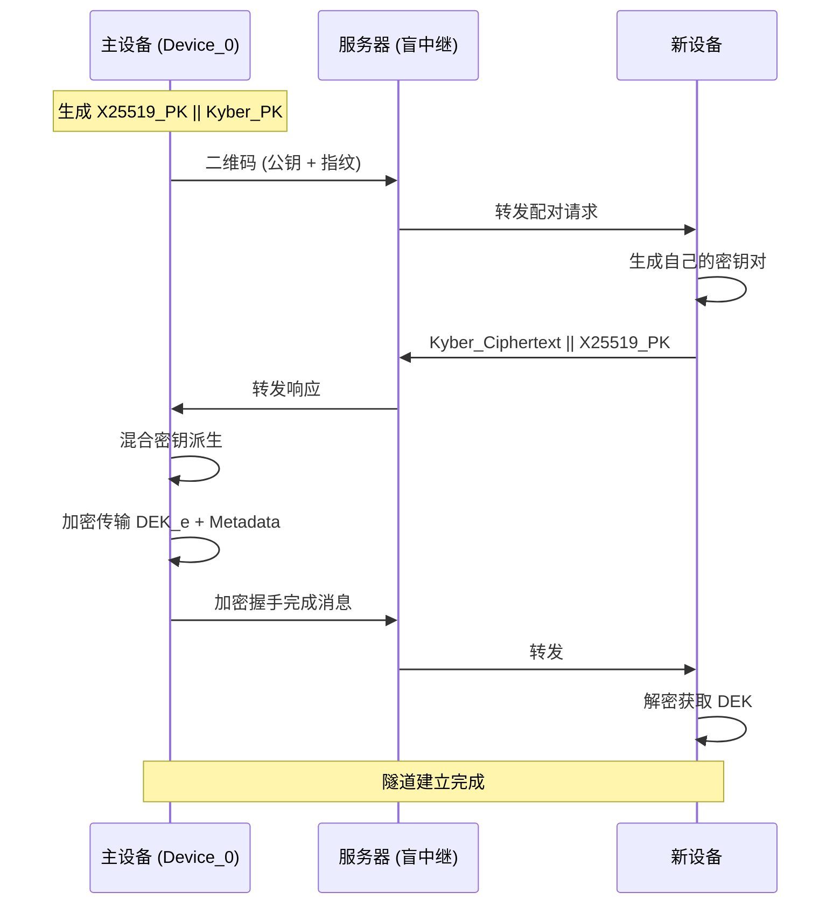
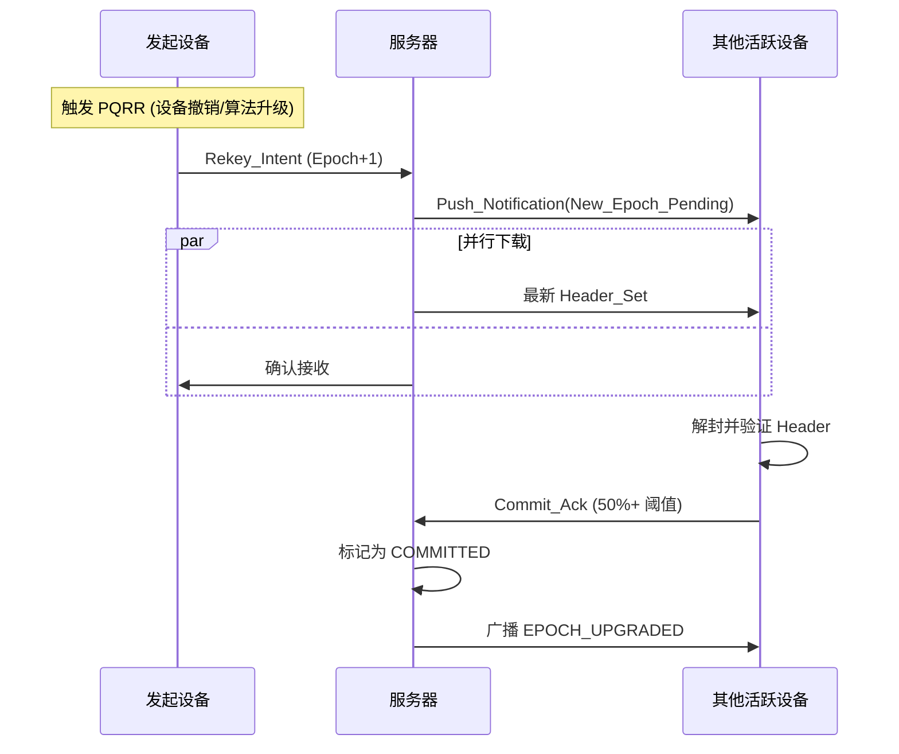
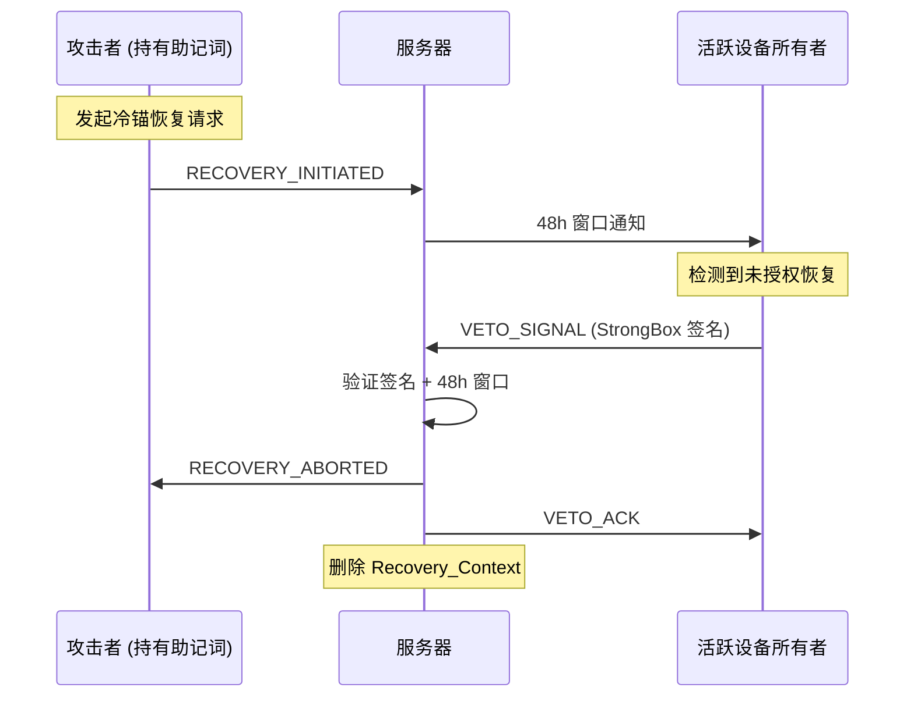

# add-sync-layer 设计文档

## 1. 概述

本文档详细描述 `core/src/sync/` 模块的架构设计、状态机定义和与现有模块的交互关系。

---

## 2. 模块架构

```
core/src/sync/
├── mod.rs              # 模块导出
├── frame.rs           # WireFrame 结构体（8192 字节固定帧）
├── codec.rs           # PayloadType 枚举 + MessageCodec trait
├── handshake.rs       # HybridHandshake（X25519 + Kyber-1024）
├── chaff.rs          # ChaffGenerator（流量混淆）
└── wire.rs           # WireProtocol（核心协议逻辑）
```

### 2.1 依赖关系

```
                    ┌─────────────────┐
                    │   models/       │
                    │  (Epoch, Header)│
                    └────────▲────────┘
                             │
┌─────────────┐    ┌─────────┴────────┐    ┌─────────────┐
│   crypto/   │◄───│      sync/       │◄───│  storage/   │
│ (KEM, AEAD) │    │   (本提案)       │    │    (AUP)    │
└─────────────┘    └──────────────────┘    └─────────────┘
```

---

## 3. 状态机定义

### 3.1 握手协议状态机

```
┌─────────────┐
│   INIT     │  初始状态，等待发起
└──────┬──────┘
       │ initiate()
       ▼
┌─────────────────────┐
│  KEYS_GENERATED    │  X25519 + Kyber 密钥对已生成
└──────┬──────────────┘
       │ send_public_keys()
       ▼
┌─────────────────────┐
│  WAITING_RESPONSE   │  等待对方响应
└──────┬──────────────┘
       │ receive_response()
       ▼
┌─────────────────────┐
│  DERIVING_KEYS      │  派生会话密钥
└──────┬──────────────┘
       │ derive_session_key()
       ▼
┌─────────────────────┐
│  ESTABLISHED       │  隧道建立成功
└─────────────────────┘
```

### 3.2 WireProtocol 状态机

```
┌─────────────┐
│   IDLE     │  空闲，无活跃会话
└──────┬──────┘
       │
       ├─► receive_handshake() ──► HANDSHAKING
       │                             │
       │                             ▼
       │                      ┌──────────────┐
       │                      │ ESTABLISHED  │  会话已建立
       │                      └──────┬───────┘
       │                             │
       ├─► receive_sync() ───────────┤
       │                             │
       ├─► receive_veto() ───────────┤
       │                             ▼
       │                      ┌──────────────┐
       └──────────────────────│ REKEYING     │  纪元升级中
                              └──────────────┘
```

---

## 4. 时序图

### 4.1 设备配对流程



### 4.2 全局纪元升级流程 (PQRR)



### 4.3 否决信号流程 (Invariant #4)



---

## 5. 威胁模型与缓解措施

| 威胁向量 | 攻击描述 | 缓解措施 |
|---------|---------|---------|
| **流量分析攻击** | 通过帧大小/频率推断用户行为 | 固定 8192 字节帧 + Chaff Sync |
| **重放攻击** | 截获历史消息重复发送 | Nonce 去重 + 服务器端 memo |
| **中间人攻击 (MITM)** | 拦截并篡改握手消息 | 混合加密 (X25519 + Kyber) + 指纹验证 |
| **量子攻击** | 量子计算机破解经典 ECDH | Kyber-1024 提供后量子安全 |
| **时序攻击** | 通过响应时间推测操作类型 | 50ms-200ms 随机抖动 |
| **恢复劫持** | 攻击者持有助记词发起恢复 | 48h 否决权 (Invariant #4) |
| **纪元回滚** | 强制设备使用旧密钥 | 纪元单调性检查 (Invariant #1) |

---

## 6. 数据结构定义

### 6.1 WireFrame 结构

```rust
#[repr(C)]
pub struct WireFrame {
    // 固定头部 (29 字节)
    pub nonce: [u8; 24],           // XChaCha20-Poly1305 随机数
    pub epoch: u32,                 // 当前逻辑纪元版本（明文）
    pub payload_type: u8,           // 消息类型 (PayloadType)

    // 可变负载
    pub encrypted_body: Vec<u8>,    // AEAD 加密后的负载
    pub padding: Vec<u8>,           // 随机填充（确保总长度 8192）

    // 认证标签 (16 字节)
    pub auth_tag: [u8; 16],         // Poly1305 认证标签
}

impl WireFrame {
    pub const FRAME_SIZE: usize = 8192;

    pub fn new(epoch: u32, payload_type: PayloadType, body: Vec<u8>) -> Self;
    pub fn serialize(&self) -> [u8; Self::FRAME_SIZE];
    pub fn deserialize(data: &[u8]) -> Result<Self, FrameError>;
    pub fn validate(&self) -> Result<(), FrameError>;
}
```

### 6.2 PayloadType 枚举

```rust
#[repr(u8)]
#[derive(Debug, Clone, Copy, PartialEq, Eq)]
pub enum PayloadType {
    Handshake = 0x01,  // 设备配对
    Sync = 0x02,       // 纪元同步
    Veto = 0x03,       // 否决信号（最高优先级）
    Recovery = 0x04,   // 恢复流程
    Chaff = 0xFF,      // 诱饵流量
}
```

### 6.3 HybridHandshake 结构

```rust
pub struct HybridHandshake {
    // X25519 密钥对
    pub x25519_keypair: x25519_dalek::Keypair,
    // Kyber-1024 密钥对
    pub kyber_keypair: pqcrypto_kyber::Keypair,
    // 派生的会话密钥
    pub session_key: Option<Zeroizing<Vec<u8>>>,
}

impl HybridHandshake {
    pub fn new() -> Self;
    pub fn public_keys(&self) -> Vec<u8>;  // X25519_PK || Kyber_PK
    pub fn initiate(&mut self, peer_public: &[u8]) -> Result<Vec<u8>, HandshakeError>;
    pub fn respond(&mut self, peer_public: &[u8], ciphertext: &[u8]) -> Result<Vec<u8>, HandshakeError>;
    pub fn derive_session_key(&mut self, ss_x25519: &[u8], ss_kyber: &[u8]) -> [u8; 32];
}
```

---

## 7. 性能指标

| 指标 | 目标值 | 说明 |
|------|-------|------|
| **握手延迟** | < 500ms | 完整混合握手流程 |
| **帧序列化** | < 1ms | 8192 字节帧序列化 |
| **Chaff 生成** | < 5ms | 诱饵流量生成 |
| **纪元同步** | < 2s | 50%+ 设备确认 |
| **否决响应** | < 100ms | 否决信号传播 |
| **内存占用** | < 10MB | sync 模块常驻内存 |
| **测试覆盖率** | ≥ 95% | 单元测试 + 集成测试 |

---

## 8. 与现有模块的集成

### 8.1 与 crypto/ 模块的交互

```rust
// 使用 crypto::kem::Kyber1024
use aeternum_crypto::kem::{Kyber1024, EncappedKey};

// 使用 crypto::aead::XChaCha20Poly1305
use aeternum_crypto::aead::{XChaCha20Poly1305, AEAD};

// 使用 crypto::kdf::KDF
use aeternum_crypto::kdf::blake3::Blake3KDF;
```

### 8.2 与 models/ 模块的交互

```rust
// 使用 models::epoch::Epoch
use aeternum_models::epoch::Epoch;

// 使用 models::header::DeviceHeader
use aeternum_models::header::DeviceHeader;
```

### 8.3 与 storage/ 模块的交互

```rust
// 使用 storage::aup::AtomicUpdateProtocol
use aeternum_storage::aup::AtomicUpdateProtocol;

// 纪元升级时触发 AUP
pub fn execute_pqrr(&self, next_epoch: Epoch) -> Result<(), StorageError>;
```

---

## 9. 测试策略

### 9.1 单元测试

- ✅ 帧序列化/反序列化往返测试
- ✅ 固定长度 8192 字节约束测试
- ✅ 认证标签验证测试
- ✅ 握手协议完整流程测试
- ✅ 会话密钥派生确定性测试
- ✅ Chaff 生成不可区分性测试

### 9.2 集成测试

- ✅ 与 crypto/ 模块的集成测试
- ✅ 与 models/ 模块的集成测试
- ✅ 与 storage/ 模块的 AUP 集成测试
- ✅ 完整 PQRR 纪元升级流程测试
- ✅ 否决信号优先级测试

### 9.3 属性测试 (proptest)

- ✅ 帧大小恒定性测试
- ✅ Nonce 唯一性测试
- ✅ 加密/解密幂等性测试

---

## 10. 安全检查清单

在完成实现前，必须确认：

- [ ] 所有 WireFrame 严格 8192 字节
- [ ] 所有消息通过 AEAD 加密
- [ ] Nonce 去重机制生效
- [ ] 否决信号具有最高优先级 (Invariant #4)
- [ ] 纪元单调递增检查生效 (Invariant #1)
- [ ] 敏感数据结构实现 Zeroize
- [ ] 测试覆盖率 ≥ 95%
- [ ] 形式化验证通过 (如适用)

---

## 11. 未来扩展

- **v2.0**: 支持 Tor/.onion 隐藏服务传输
- **v2.1**: 支持蓝牙 LE 直接设备间通信
- **v2.2**: 支持量子密钥分发 (QKD) 硬件集成
