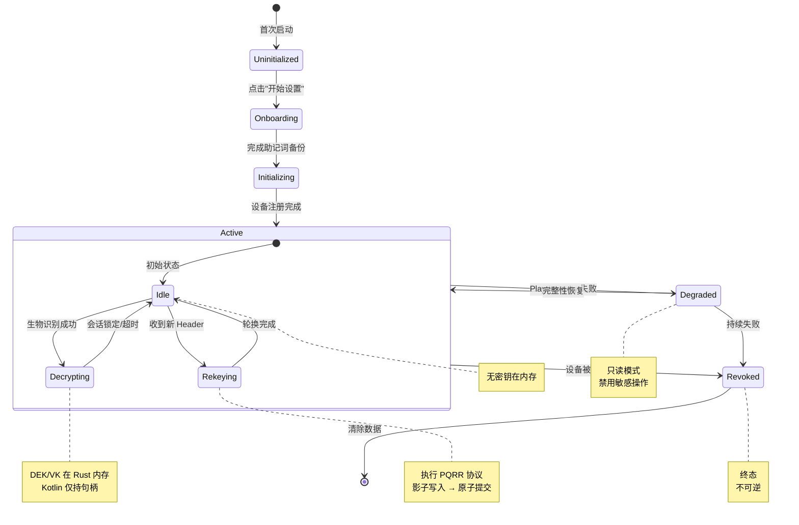
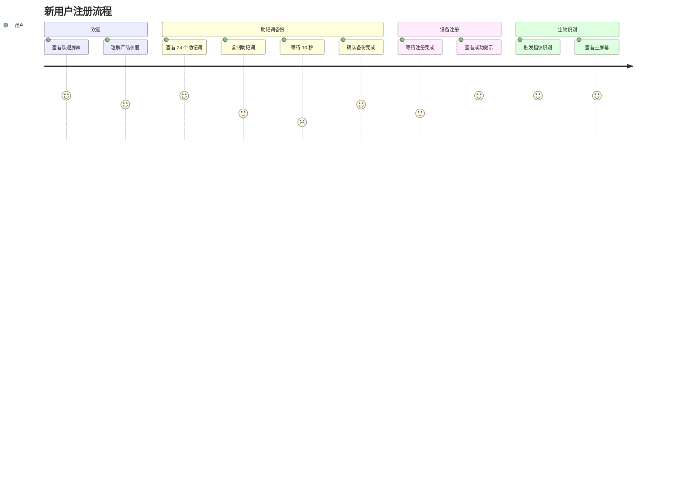
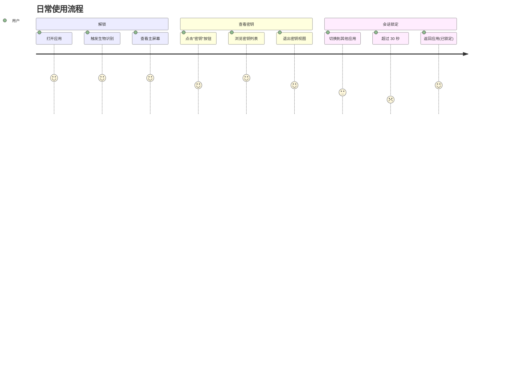

# Aeternum UI Mockups - 后量子安全密钥管理器

> 设计风格：Material Design 3 深色主题 + 量子科技感
> 色彩系统：量子蓝 (#00BCD4)、深空灰 (#121212)、量子红 (#FF5252)、量子绿 (#69F0AE)

---

## 目录

1. [设计系统](#设计系统)
2. [屏幕 Mockups](#屏幕-mockups)
3. [状态机流程](#状态机流程)
4. [用户旅程](#用户旅程)
5. [组件库](#组件库)

---

## 设计系统

### 色彩板

```
┌─────────────────────────────────────────────────────────────┐
│  Primary (量子蓝)      │  Secondary (深空灰)               │
│  #00BCD4               │  #121212                          │
│  ┌─────────┐          │  ┌─────────┐                      │
│  │ ███████ │          │  │ ███████ │                      │
│  └─────────┘          │  └─────────┘                      │
├─────────────────────────────────────────────────────────────┤
│  Success (量子绿)     │  Warning (量子黄)                  │
│  #69F0AE               │  #FFD740                          │
│  ┌─────────┐          │  ┌─────────┐                      │
│  │ ███████ │          │  │ ███████ │                      │
│  └─────────┘          │  └─────────┘                      │
├─────────────────────────────────────────────────────────────┤
│  Error (量子红)       │  Info (量子蓝浅)                   │
│  #FF5252               │  #40C4FF                          │
│  ┌─────────┐          │  ┌─────────┐                      │
│  │ ███████ │          │  │ ███████ │                      │
│  └─────────┘          │  └─────────┘                      │
└─────────────────────────────────────────────────────────────┘
```

### 排版系统

```
Headline Large  (57sp)  - 屏幕标题
Headline Medium (32sp)  - 区域标题
Title Large      (22sp)  - 卡片标题
Body Large      (16sp)  - 正文
Label Large     (14sp)  - 按钮、标签
```

---

## 屏幕 Mockups

### 1. 欢迎屏幕 (WelcomeScreen)

```
╔═══════════════════════════════════════════════════════════╗
║                                                           ║
║                                                           ║
║                      ┌───────┐                          ║
║                      │  ◯◯◯  │                          ║
║                      │ ◯   ◯ │   Aeternum                ║
║                      │  ◯◯◯  │   后量子安全密钥管理        ║
║                      └───────┘                          ║
║                                                           ║
║                                                           ║
║                   🛡️ 业界领先的量子安全防护              ║
║                                                           ║
║                   🔒 零知识架构，您的数据仅您可见      ║
║                                                           ║
║                   🔐 设备间无缝同步与恢复               ║
║                                                           ║
║                                                           ║
║                                                           ║
║   ┌─────────────────────────────────────────────────────┐   ║
║   │          开始设置                     →            │   ║
║   └─────────────────────────────────────────────────────┘   ║
║                                                           ║
║                                                           ║
╚═══════════════════════════════════════════════════════════╝
```

**关键元素**:
- 量子 Logo (旋转动画)
- 产品名称和标语
- 三个核心功能点
- "开始设置" 主按钮 (量子蓝)

---

### 2. 助记词备份屏幕 (MnemonicBackupScreen)

```
╔═══════════════════════════════════════════════════════════╗
║  ← 创建备份                              [?]           ║
╠═══════════════════════════════════════════════════════════╣
║                                                           ║
║                    请安全保存您的助记词                    ║
║                                                           ║
║  ┌──────────────────────────────────────────────────────┐   ║
║  │  actually   ancient    arrive    autumn     │   ║
║  │  bacon      balcony    banana    banner     │   ║
║  │  barrel     beach      become     before     │   ║
║  │  begin      between    birth      black      │   ║
║  │  blade      blanket    blast      bless      │   ║
║  │  blood      board      boast      bolt       │   ║
║  │  bomb       bond       bone       book       │   ║
║  └──────────────────────────────────────────────────────┘   ║
║                                                           ║
║   ┌─────────┐      ┌──────────────────────┐             ║
║   │  复制   │      │  [👁] 显示          │             ║
║   └─────────┘      └──────────────────────┘             ║
║                                                           ║
║  ┏━━━━━━━━━━━━━━━━━━━━━━━━━━━━━━━━━━━━━━━━━━━━━━━━━┓   ║
║  ┃ ⚠️  警告                                           ┃   ║
║  ┃                                                    ┃   ║
║  ┃  这些助记词是恢复您密钥的唯一方式。              ┃   ║
║  ┃  请将其写在纸上并存放在安全的地方。              ┃   ║
║  ┃  切勿截图、拍照或存储在云服务中。                ┃   ║
║  ┗━━━━━━━━━━━━━━━━━━━━━━━━━━━━━━━━━━━━━━━━━━━━━━━━━┛   ║
║                                                           ║
║                     ⏱️ 请等待 10 秒...                   ║
║                                                           ║
║   ┌─────────────────────────────────────────────────────┐   ║
║   │  我已经安全保存                    禁用 →        │   ║
║   └─────────────────────────────────────────────────────┘   ║
║                                                           ║
╚═══════════════════════════════════════════════════════════╝
```

**关键元素**:
- 24 个助记词网格 (3列 × 8行)
- 复制按钮 (左侧)
- 显示/隐藏按钮 (右侧，默认隐藏)
- 红色警告框 (双线边框)
- 10 秒倒计时
- "我已经安全保存" 按钮 (初始禁用，10秒后启用)

---

### 3. 生物识别认证屏幕 (BiometricPromptScreen)

```
╔═══════════════════════════════════════════════════════════╗
║                                                           ║
║                                                           ║
║                      ┌──────────┐                          ║
║                      │          │                          ║
║                      │   🖐️     │   请验证身份以访问        ║
║                      │  ( )     │                          ║
║                      │          │   Aeternum Vault           ║
║                      │  ⚙️     │                          ║
║                      └──────────┘                          ║
║                                                           ║
║                                                           ║
║                  [ ← 取消 ]                              ║
║                                                           ║
║                                                           ║
╚═══════════════════════════════════════════════════════════╝

(背景叠加生物识别系统对话框 - Android BiometricPrompt API)
```

**关键元素**:
- 中心对齐的指纹图标
- 副本文字
- 取消按钮 (底部)
- 生物识别对话框 (系统提供)

**状态变化**:
- 认证中: 指纹图标 + 副本 "正在验证..."
- 成功: ✓ 图标 + 淡入动画 → 主屏幕
- 失败: ✗ 图标 + 错误提示
- 取消: 返回上一个屏幕

---

### 4. 主屏幕 - Idle 状态 (MainScreen)

```
╔═══════════════════════════════════════════════════════════╗
║  ☰  Aeternum                            Epoch 5    ⚙️  ║
╠═══════════════════════════════════════════════════════════╣
║                                                           ║
║  ┌─────────────────────────────────────────────────────┐   ║
║  │  ┌───┐  🔒 安全                        Epoch 5  │   ║
║  │  │ ✓ │  2 设备已连接                            │   ║
║  │  └───┘  最后同步: 5 分钟前                      │   ║
║  └─────────────────────────────────────────────────────┘   ║
║                                                           ║
║  ┌─────────────────────────────────────────────────────┐   ║
║  │  ┌─────┐  ┌─────┐  ┌─────┐  ┌─────┐          │   ║
║  │  │ 🔐  │  │ 📱  │  │ 🔑  │  │ ⚙️  │          │   ║
║  │  │密钥 │  │设备 │  │轮换 │  │设置 │          │   ║
║  │  └─────┘  └─────┘  └─────┘  └─────┘          │   ║
║  └─────────────────────────────────────────────────────┘   ║
║                                                           ║
║  最近活动                                                 ║
║  ────────────────────────────────────────────────────     ║
║  📱 设备 "Pixel 9 Pro" 已连接                    2h   ║
║  🔑 密钥轮换完成: Epoch 4 → 5                    5h   ║
║  ✓ 生物识别认证成功                              7h   ║
║  📱 设备 "iPad Pro" 已连接                       1d   ║
║                                                           ║
╚═══════════════════════════════════════════════════════════╝
```

**关键元素**:
- 状态卡片 (绿色安全指示器 + Epoch 徽章)
- 快速操作按钮 (4个图标按钮)
- 最近活动列表 (时间戳相对显示)
- 底部导航栏 (可选)

**状态指示器**:
- 安全: 🟢 绿色圆圈 + "安全"
- 警告: 🟡 黄色三角 + "警告"
- 危险: 🔴 红色圆圈 + "危险"

---

### 5. 密钥轮换屏幕 (RekeyingScreen)

```
╔═══════════════════════════════════════════════════════════╗
║  ← 密钥轮换                                            ║
╠═══════════════════════════════════════════════════════════╣
║                                                           ║
║                      ┌──────────┐                          ║
║                      │  ◯ ◯ ◯  │                          ║
║                      │ ◯  ⬤  ◯ │   正在轮换密钥...        ║
║                      │  ◯ ◯ ◯  │                          ║
║                      └──────────┘                          ║
║                                                           ║
║                   Epoch 5  →  Epoch 6                      ║
║                                                           ║
║  ┌─────────────────────────────────────────────────────┐   ║
║  │  ░░░░░░░░░░░░░░░░░░░░░░░░░░░░░░░░░░░░░░   │   ║
║  │  ████████████████░░░░░░░░░░░░░░░░░░░░░░░   │ 80%   ║
║  └─────────────────────────────────────────────────────┘   ║
║                                                           ║
║  ┏━━━━━━━━━━━━━━━━━━━━━━━━━━━━━━━━━━━━━━━━━━━━━━━━━┓   ║
║  ┃ ⚠️  警告                                           ┃   ║
║  ┃                                                    ┃   ║
║  ┃  密钥轮换过程中，请勿关闭应用或锁屏。             ┃   ║
║  ┃  此过程可能需要几秒钟到几分钟。                    ┃   ║
║  ┗━━━━━━━━━━━━━━━━━━━━━━━━━━━━━━━━━━━━━━━━━━━━━━━━━┛   ║
║                                                           ║
║                                                           ║
║  ┌─────────┐  ┌─────────┐  ┌─────────┐                 ║
║  │  加密中 │  │  分发中 │  │  完成   │                 ║
║  └─────────┘  └─────────┘  └─────────┘                 ║
║  ───────────►  ───────────►  ───────────►                ║
║                                                           ║
╚═══════════════════════════════════════════════════════════╝
```

**关键元素**:
- 旋转量子圆环动画 (循环)
- 纪元对比 (旧 → 新)
- 进度条 (0-100%)
- 黄色警告框
- 步骤指示器 (3步流程)

**动画效果**:
- 量子圆环: 500ms 旋转，循环
- 进度条: 平滑更新
- 步骤指示器: 激活步骤高亮

---

### 6. 设备列表屏幕 (DeviceListScreen)

```
╔═══════════════════════════════════════════════════════════╗
║  ← 设备管理                                  [+ 添加]   ║
╠═══════════════════════════════════════════════════════════╣
║                                                           ║
║  我的设备 (3)                                            ║
║  ────────────────────────────────────────────────────        ║
║                                                           ║
║  ┌─────────────────────────────────────────────────────┐   ║
║  │  🟢 Pixel 9 Pro                              [▾]   │   ║
║  │  ✅ 活跃  •  Epoch 5                                │   ║
║  │  本机  •  最后同步: 2 分钟前                         │   ║
║  └─────────────────────────────────────────────────────┘   ║
║                                                           ║
║  ┌─────────────────────────────────────────────────────┐   ║
║  │  🟢 iPad Pro                                 [▾]   │   ║
║  │  ✅ 活跃  •  Epoch 5                                │   ║
║  │  平板  •  最后在线: 2 小时前                         │   ║
║  └─────────────────────────────────────────────────────┘   ║
║                                                           ║
║  ┌─────────────────────────────────────────────────────┐   ║
║  │  🟡 Pixel 8                                  [▾]   │   ║
║  │  ⚠️ 降级  •  Epoch 4                               │   ║
║  │  手机  •  最后在线: 7 天前                           │   ║
║  └─────────────────────────────────────────────────────┘   ║
║                                                           ║
║                                                           ║
╚═══════════════════════════════════════════════════════════╝
```

**关键元素**:
- 设备卡片列表 (3个设备)
- 状态指示器 (左上角圆形)
- 设备名称和类型
- 活跃状态 + 纪元
- 最后在线时间
- 菜单按钮 (右下角)

**设备状态**:
- 🟢 活跃: 设备正常
- 🟡 降级: 完整性验证失败
- 🔴 撤销: 设备已撤销

**菜单选项**:
- 查看详情
- 撤销设备 (非本机)

---

### 7. 设备详情屏幕 (DeviceDetailScreen)

```
╔═══════════════════════════════════════════════════════════╗
║  ← 设备详情                                            ║
╠═══════════════════════════════════════════════════════════╣
║                                                           ║
║  ┌─────────────────────────────────────────────────────┐   ║
║  │  🟢 Pixel 9 Pro                                      │   ║
║  │  ✅ 活跃  •  Epoch 5                                │   ║
║  │  本机                                              │   ║
║  └─────────────────────────────────────────────────────┘   ║
║                                                           ║
║  设备信息                                                ║
║  ────────────────────────────────────────────────────     ║
║  设备名称:     Pixel 9 Pro                               ║
║  设备类型:     手机                                      ║
║  注册时间:     2025-11-15                                ║
║  最后在线:     2 分钟前                                 ║
║  当前纪元:     Epoch 5                                   ║
║                                                           ║
║  安全状态                                                ║
║  ────────────────────────────────────────────────────     ║
║  设备完整性:   ✅ 通过 (Play Integrity)                 ║
║  生物识别:     ✅ 指纹 (Class 3)                       ║
║                                                           ║
║  ┌─────────────────────────────────────────────────────┐   ║
║  │  📊 使用统计                                        │   ║
║  │  • 本月认证: 156 次                                 │   ║
║  │  • 平均频率: 5.2 次/天                             │   ║
║  └─────────────────────────────────────────────────────┘   ║
║                                                           ║
║                                                           ║
║   ┌───────────────────────────────────────────────────┐   ║
║   │  [👁] 显示助记词     [←] 撤销设备              │   ║
║   └───────────────────────────────────────────────────┘   ║
║                                                           ║
╚═══════════════════════════════════════════════════════════╝
```

**关键元素**:
- 设备卡片 (顶部)
- 设备信息列表
- 安全状态列表
- 使用统计卡片
- 操作按钮 (底部)

---

### 8. 降级模式屏幕 (DegradedModeScreen)

```
╔═══════════════════════════════════════════════════════════╗
║                                                           ║
║                                                           ║
║                      ┌──────────┐                          ║
║                      │          │                          ║
║                      │   ⚠️     │   安全模式已激活         ║
║                      │  ( )     │                          ║
║                      │   !     │                          ║
║                      └──────────┘                          ║
║                                                           ║
║  设备完整性验证失败。                                     ║
║                                                           ║
║  可能的原因:                                             ║
║  • 设备已 Root 或安装了未经授权的应用                    ║
║  • 系统文件被修改                                       ║
║  • Play Integrity 服务无法访问                            ║
║                                                           ║
║  在安全模式下，以下功能被禁用:                          ║
║  ❌ 查看完整密钥数据                                     ║
║  ❌ 导出密钥                                            ║
║  ❌ 发起恢复流程                                          ║
║  ❌ 执行密钥轮换                                          ║
║                                                           ║
║  ┌─────────────────────────────────────────────────────┐   ║
║  │              了解详情 [→]                            │   ║
║  └─────────────────────────────────────────────────────┘   ║
║                                                           ║
║  ┌─────────────────────────────────────────────────────┐   ║
║  │  🔄 重新验证设备完整性                               │   ║
║  └─────────────────────────────────────────────────────┘   ║
║                                                           ║
║                                                           ║
╚═══════════════════════════════════════════════════════════╝
```

**关键元素**:
- 大号警告图标 (黄色/橙色)
- "安全模式已激活" 标题
- 可能原因列表
- 禁用功能列表
- "了解详情" 按钮 (次要)
- "重新验证" 按钮 (主要)

---

### 9. 撤销状态屏幕 (RevokedScreen)

```
╔═══════════════════════════════════════════════════════════╗
║                                                           ║
║                                                           ║
║                      ┌──────────┐                          ║
║                      │          │                          ║
║                      │   🔗     │   此设备已被撤销         ║
║                      │  ( )     │                          ║
║                      │   ✗     │                          ║
║                      └──────────┘                          ║
║                                                           ║
║  所有密钥和数据已从本设备清除。                         ║
║                                                           ║
║  如需重新使用 Aeternum，请:                              ║
║  1. 在其他活跃设备上打开 Aeternum                      ║
║  2. 进入"设备管理"，点击"添加设备"                      ║
║  3. 扫描此设备显示的二维码或输入配对码                    ║
║                                                           ║
║  ┌─────────────────────────────────────────────────────┐   ║
║  │  📄 为什么我的设备被撤销？              [→]         │   ║
║  └─────────────────────────────────────────────────────┘   ║
║                                                           ║
║                                                           ║
║   ┌───────────────────────────────────────────────────┐   ║
║   │  确认并关闭应用                              │   ║
║   └───────────────────────────────────────────────────┘   ║
║                                                           ║
║                                                           ║
╚═══════════════════════════════════════════════════════════╝
```

**关键元素**:
- 撤销图标 (红色链条 + X)
- "此设备已被撤销" 标题
- 清除提示
- 重新使用指引 (3步)
- "了解原因" 按钮
- "确认并关闭" 按钮

---

### 10. 否决通知屏幕 (VetoNotificationScreen)

```
╔═══════════════════════════════════════════════════════════╗
║  ← 否决通知                                            ║
╠═══════════════════════════════════════════════════════════╣
║                                                           ║
║  ┌─────────────────────────────────────────────────────┐   ║
║  │  ┌───┐  🔴 否决信号!                    Epoch 5  │   ║
║  │  │ ⊘ │  恢复请求已被拦截                          │   ║
║  │  └───┘                                             │   ║
║  └─────────────────────────────────────────────────────┘   ║
║                                                           ║
║  检测到可疑的恢复尝试，已被您的设备自动否决。           ║
║                                                           ║
║  ┏━━━━━━━━━━━━━━━━━━━━━━━━━━━━━━━━━━━━━━━━━━━━━━━━━┓   ║
║  ┃ ⚠️  事件详情                                        ┃   ║
║  ┃                                                    ┃   ║
║  ┃  恢复来源:   未知设备或助记词                  ┃   ║
║  ┃  否决时间:   2026-02-15 14:32                   ┃   ║
║  ┃  否决设备:   Pixel 9 Pro (本机)                ┃   ║
║  ┃  剩余窗口:   47小时58分钟                       ┃   ║
║  ┗━━━━━━━━━━━━━━━━━━━━━━━━━━━━━━━━━━━━━━━━━━━━━━━━━┛   ║
║                                                           ║
║  ┌─────────────────────────────────────────────────────┐   ║
║  │  这是第 48 小时否决窗口期。在此期间，              │   ║
║  │  如果您确认此恢复请求是合法的，可以撤回否决。    │   ║
║  └─────────────────────────────────────────────────────┘   ║
║                                                           ║
║  ┌─────────────────────────────────────────────────────┐   ║
║  │  📱 设备 "iPad Pro" 也已否决此请求             │   ║
║  └─────────────────────────────────────────────────────┘   ║
║                                                           ║
║                                                           ║
║  ┌─────────────────┐  ┌─────────────────┐             ║
║  │  撤回否决       │  │  了解否决机制    │             ║
║  └─────────────────┘  └─────────────────┘             ║
║                                                           ║
╚═══════════════════════════════════════════════════════════╝
```

**关键元素**:
- 危险状态卡片 (红色)
- 事件详情列表
- 剩余窗口倒计时
- 其他否决设备提示
- "撤回否决" 按钮 (主要)
- "了解否决机制" 按钮 (次要)

**动画效果**:
- 红色圆环: 1000ms 脉冲，循环
- 倒计时: 每秒更新

---

## 状态机流程

### Mermaid 状态转换图



---

## 用户旅程

### Mermaid 用户流程图 - 新用户注册



### Mermaid 用户流程图 - 日常使用



---

## 组件库

### 状态指示器 (StatusIndicator)

```
┌─────────────────────────────────────────┐
│  ┌───┐  🔒 安全                      │
│  │ ✓ │  2 设备已连接                │
│  └───┘  最后同步: 5 分钟前          │
└─────────────────────────────────────────┘

┌─────────────────────────────────────────┐
│  ┌───┐  ⚠️ 警告                     │
│  │ ! │  1 设备降级                  │
│  └───┘  请检查设备完整性            │
└─────────────────────────────────────────┘

┌─────────────────────────────────────────┐
│  ┌───┐  🔴 危险                     │
│  │ ✗ │  收到否决信号                │
│  └───┘  需要立即处理                │
└─────────────────────────────────────────┘
```

### 纪元徽章 (EpochBadge)

```
┌─────────┐
│ Epoch 5 │
└─────────┘

(绿色背景 = 当前纪元)
(黄色背景 = 落后纪元)
```

### 量子动画 (QuantumAnimation)

```
旋转动画 (密钥轮换):
┌──────────┐
│  ◯ ◯ ◯  │  →  ┌──────────┐
│ ◯  ⬤  ◯ │  →  │  ◯ ◯ ◯  │
│  ◯ ◯ ◯  │  →  │ ⬤  ◯  ◯ │
└──────────┘     └──────────┘

脉冲动画 (否决信号):
┌──────────┐
│ ╭───────╮ │  →  ╭─────────╮  →  ╭───────╮
│ │ (●)  │ │  →  │  (●)    │  →  │  (●)  │
│ ╰───────╯ │  →  ╰─────────╯  →  ╰───────╯
└──────────┘     (1000ms 循环)
```

### 设备卡片 (DeviceCard)

```
┌─────────────────────────────────────────┐
│  🟢 Pixel 9 Pro                [▾]    │
│  ✅ 活跃  •  Epoch 5                │
│  本机  •  最后同步: 2 分钟前        │
└─────────────────────────────────────────┘
```

### 警告横幅 (WarningBanner)

```
┏━━━━━━━━━━━━━━━━━━━━━━━━━━━━━━━━━━━━━━━┓
┃ ⚠️  警告                               ┃
┃                                        ┃
┃  这些助记词是恢复您密钥的唯一方式。   ┃
┃  请将其写在纸上并存放在安全的地方。   ┃
┗━━━━━━━━━━━━━━━━━━━━━━━━━━━━━━━━━━━━━━━┛
```

---

## 交互模式

### 手势导航

```
滑动返回:
◄───────────────  ◄───────────────
  上一屏幕        当前屏幕

下拉刷新:
  ┌─────────┐
  │         │ ╲  下拉刷新
  │  内容   │ ╲
  │         │ ╲
  └─────────┘

侧滑操作 (设备列表):
  ┌─────────┐
  │ 设备卡  │ ╲  向左滑动 → 显示操作菜单
  │         │ ╲
  └─────────┘
```

---

## 响应式布局

### 手机 (竖屏)

```
所有上述 Mockup 均为手机竖屏布局
宽度: 360dp - 400dp
高度: 640dp - 900dp
```

### 手机 (横屏)

```
侧边栏导航 + 主内容区
┌──────────────┬────────────────────┐
│              │                     │
│   导航       │     主内容         │
│              │                     │
│              │                     │
└──────────────┴────────────────────┘
```

### 平板

```
双栏布局 (设备列表)
┌────────────────────┬────────────────────┐
│                    │                    │
│    设备列表        │    设备详情        │
│                    │                    │
└────────────────────┴────────────────────┘
```

---

**Mockup 版本**: 1.0.0
**创建日期**: 2026-02-15
**设计工具**: ASCII Art + Mermaid
**设计师**: Aeternum Team
